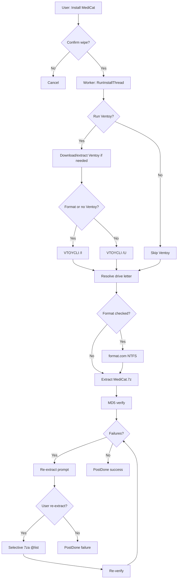

# MediCat Installer — Architecture & Project Outline

Native Windows (Win32) installer for MediCat USB bootable media. Active branch: **`cpp`**.  
User-facing overview: [`README.md`](../README.md) · Feature parity: [`FEATURES.md`](../FEATURES.md) · Roadmap: [`TODO.md`](../TODO.md)

---

## Project outline

```
medicat_installer/
├── src/                    # C++ application (namespace medicat)
│   ├── main.cpp            # WinMain → App::Run()
│   ├── app.cpp / app.h     # Orchestration, worker threads, verify/re-extract
│   ├── gui.cpp / gui.h     # Main window, dialogs, progress, status bar
│   ├── drives.cpp          # USB / VHD / fixed-disk enumeration
│   ├── ventoy.cpp          # Ventoy download, extract, VTOYCLI /I /U
│   ├── extract.cpp         # 7za subprocess (full + selective @list)
│   ├── verify.cpp          # Parallel MD5 against MedicatFiles.md5
│   ├── bundle.cpp          # Embedded 7za, 7z, MD5 resources
│   ├── download.cpp        # WinHTTP (Ventoy, mirrors)
│   ├── offline.cpp         # Offline Ventoy/archive cache paths
│   ├── debug.cpp           # System/installer diagnostics → medicat_installer.log
│   ├── log.cpp             # medicat_installer.log
│   ├── i18n.cpp            # Runtime translation lookup
│   ├── i18n_generated.h    # Build-generated string table (do not edit by hand)
│   ├── theme.cpp           # Dark GDI+ controls
│   └── util.cpp            # Paths, file helpers
├── i18n/
│   └── translations.json   # EN, ES, FR, PL, TR source strings
├── tools/
│   ├── i18n_codegen.py     # translations.json → i18n_generated.h
│   ├── fetch_ventoy_versions.py
│   └── populate_offline.py # Optional offline cache setup
├── res/
│   ├── app.manifest        # requireAdministrator
│   ├── bundle.rc.in        # Embedded binary resources
│   └── ventoy_versions.txt # Fallback version list
├── docs/
│   └── ARCHITECTURE.md     # This file
├── build/                  # CMake output (gitignored)
├── 7za.exe / bin/7z.exe    # Bundled into exe at build time
├── MedicatFiles.md5        # Verification manifest (bundled)
├── CMakeLists.txt
├── README.md
├── FEATURES.md
└── TODO.md
```

**Runtime layout (beside exe):** logs (`*.log`, `failed_files.txt`), `Ventoy2Disk/` after Ventoy download, optional `offline/` cache. MediCat `*.7z` is user-supplied or downloaded via UI.

---

## Layered design

| Layer | Modules | Responsibility |
|-------|---------|----------------|
| **Entry** | `main`, `App` | Startup, bundle extract, wire GUI handlers |
| **UI** | `gui`, `theme` | HWNDs, user input, thread-safe updates via `WM_APP` |
| **Workflow** | `app` | Install / verify sequences, confirmations, `PostDone` |
| **Domain** | `drives`, `ventoy`, `extract`, `verify` | Drive identity, tooling subprocesses |
| **Infrastructure** | `bundle`, `download`, `offline`, `log`, `debug`, `i18n` | Assets, network, diagnostics |

---

## Threading model

Long operations run on **detached `std::thread` workers**. The GUI thread owns all HWNDs.

```
Worker thread                          UI thread (gui.cpp WndProc)
─────────────────                      ───────────────────────────
RunInstallThread / RunVerifyThread
    │
    ├─ PostProgress(%)        ───────►  WM_MEDICAT_PROGRESS → SetProgress
    ├─ PostExtractProgress    ───────►  WM_MEDICAT_PROGRESS → NotifyExtractProgress
    ├─ PostStatusBar(text)    ───────►  WM_MEDICAT_PROGRESS (statusOnly) → SetStatusBar
    └─ PostDone(ok, msg)      ───────►  WM_MEDICAT_DONE → ShowDone + SetBusy(false)
```

**Rules**

- Never call `SetWindowText`, `SendMessage` to HWNDs, or GDI from workers.
- Listbox lines for file log: store strings in `fileLogDisplayLines_` (no temporaries to `LB_ADDSTRING`).
- `Gui::SetBusy(true)` disables inputs; `SetBusy(false)` restores Ventoy status on the status bar.

---

## Install flow (high level)



### Ventoy / format decision table

| Ventoy on drive | Format checkbox | Update Ventoy | Ventoy CLI |
|-----------------|-----------------|----------------|------------|
| No | Forced on (logic) | Forced on (logic) | `/I` |
| Yes | User choice | Unchecked | Skip Ventoy |
| Yes | User choice | Checked | `/U` (if format off) |
| Yes | Checked | Either | `/I` |

Detection: `{drive}\ventoy` folder **or** physical-disk layout matching Ventoy2Disk (`VTOYEFI` 32 MiB EFI partition at sector 2048 layout) via `TestVentoyInstalled`.

**UI vs logic:** When Ventoy is missing, checkboxes show checked state but stay **enabled**; `FormatChecked()` / `RunVentoyChecked()` enforce `true` via `RequiresForcedVentoyInstall()`. Drive-letter changes refresh labels/checks; toggling **Show all drives** does not.

---

## Verify flow

1. **Check USB Files** or post-install → `VerifyDriveFiles`
2. Parallel MD5 workers, `check.log` per file
3. On failure → `failed_files.txt` + re-extract window (`WM_MEDICAT_REEXTRACT_PROMPT`)
4. Optional `Extract7zArchiveSelective` → `reextract.log` → re-verify
5. Still failing → AV/firewall hint (`messages.verify_still_failed_after_reextract`)

---

## Custom messages (`gui.h`)

| Message | Payload | Purpose |
|---------|---------|---------|
| `WM_MEDICAT_PROGRESS` | `ProgressPayload*` | Progress, extract lines, status bar |
| `WM_MEDICAT_DONE` | `DonePayload*` | Operation finished |
| `WM_MEDICAT_VENTOY_VERSIONS` | version list | Populate Advanced combo |
| `WM_MEDICAT_REEXTRACT_PROMPT` | `ReExtractPromptPayload*` | Block worker on user choice |

---

## Build pipeline

1. **CMake** configures MSVC project (x64 / ARM64).
2. **i18n_codegen.py** → `src/i18n_generated.h`
3. **fetch_ventoy_versions.py** → embedded version list
4. **bundle.rc** embeds `7za.exe`, `7z.exe`, `MedicatFiles.md5`
5. Output: `build/Release/MedicatInstaller.exe` (single-file distribution; tools extracted to `%TEMP%\MedicatInstaller\{pid}\` at runtime)

---

## Logging

| File | Writer | When |
|------|--------|------|
| `medicat_installer.log` | `log.cpp`, `debug.cpp` | Every session (includes diagnostic sections) |
| `extract.log` | `extract.cpp` | Full 7za extract |
| `reextract.log` | `extract.cpp` | Selective re-extract |
| `check.log` | `verify.cpp` | MD5 pass/fail lines |
| `failed_files.txt` | `verify.cpp` | Verification failures |

Future support upload: **`.log` / `.txt` only** — see [`TODO.md`](../TODO.md).

---

## i18n

- Source: `i18n/translations.json` (five languages)
- Runtime: `i18n::Tr(L"key")` or `i18n::Tr(L"key", arg1, …)`
- **Add keys in all languages** before merging UI changes
- Rebuild regenerates `i18n_generated.h`

---

## Code conventions

- C++17, MSVC `/W4 /utf-8`, namespace `medicat`
- Wide strings for Windows paths and UI; UTF-8 in log files
- Extended paths `\\?\` in `verify.cpp` for long manifest paths
- MD5 buffers on heap (`std::vector<BYTE>`), not large stack arrays
- Match existing file style; avoid over-abstraction

---

## Simplification notes (for contributors)

### Already simplified

- **Forced Ventoy install** — single helper `RequiresForcedVentoyInstall()` drives getters, UI refresh, and re-check on click (no `EnableWindow` greying).
- **Drive refresh** — Ventoy/format controls update only when the **drive letter** changes, not when the drive list is rebuilt.

### Reasonable next refactors (not required)

| Area | Issue | Suggestion |
|------|-------|------------|
| `gui.cpp` (~2k lines) | Monolithic UI | Split: `gui_layout.cpp`, `gui_checkbox.cpp`, `gui_reextract.cpp` |
| `ProgressPayload` | Many bool flags | Small enum `ProgressKind { Percent, Extract, Status }` |
| `app.cpp` install thread | Long linear function | Named phases: `RunVentoyPhase`, `RunFormatPhase`, `RunExtractPhase` |
| Ventoy UI state | Label + check in one function | Table-driven `struct DriveVentoyUiState { labelKey; defaultChecked; }` |
| Confirm dialogs | Duplicated MessageBox patterns | Thin `ConfirmYesNo(hwnd, titleKey, messageKey, …)` helper |

### Avoid

- Porting PowerShell `form.Invoke` patterns — use message posting.
- Calling Win32 GUI APIs from worker threads.
- Committing `build/`, logs, `Ventoy2Disk/`, or `.7z` archives.

---

## Security / safety

- Destructive ops: wipe confirmation, Ventoy warning, drive-letter change confirmation
- Admin elevation required (manifest)
- MD5 reads full file; partial reads fail
- Internet needed for Ventoy download (offline cache supported); verify-only can use bundled manifest

---

## Branch reference

| Branch | Role |
|--------|------|
| `cpp` | Active C++ installer |
| `pwsh` | Legacy PowerShell GUI (parity reference) |
| `main` | Legacy batch scripts |
