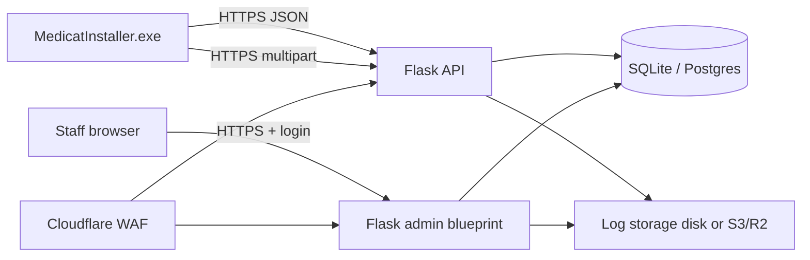

# Support server — subdomain ideas & Flask app design

Backend for MediCat installer telemetry ([`SUPPORT_UPLOAD.md`](SUPPORT_UPLOAD.md)): ingest Tier A session JSON, store Tier B log zips, staff dashboard with stats.

**Status:** Flask implementation lives in the private repo **[mon5termatt/medicat-support-server](https://github.com/mon5termatt/medicat-support-server)** (not in this public tree). Design and API contract remain documented here.

---


| Host | Role |
|------|------|
| `telemetry.medicatusb.com` | Public ingest API (`POST /v1/sessions`, `POST /v1/support/uploads`) |
| `telemetry.medicatusb.com/admin` | Staff dashboard (Flask, login required) |

Single app behind one subdomain is fine for v1. Use Cloudflare (or similar) for TLS, WAF, and rate limits in front of Flask.

**DNS:** `A`/`AAAA` or `CNAME` → VPS, or `CNAME` → tunnel (Cloudflare Tunnel, Tailscale Funnel) if no public IP.

---

## High-level architecture



| Component | v1 suggestion |
|-----------|----------------|
| App | Flask 3.x + Gunicorn |
| DB | SQLite (single VPS) → Postgres when traffic grows |
| Log blobs | Local `data/uploads/` → S3-compatible (R2) later |
| Reverse proxy | Caddy or nginx → Gunicorn unix socket |
| Process manager | systemd |

---

## Flask app layout

```
support-server/
├── app/
│   ├── __init__.py          # create_app(), extensions
│   ├── config.py            # env-based settings
│   ├── models.py            # SQLAlchemy: SessionReport, Upload
│   ├── api/
│   │   ├── __init__.py
│   │   ├── sessions.py      # POST /v1/sessions
│   │   └── uploads.py       # POST /v1/support/uploads
│   ├── admin/
│   │   ├── __init__.py
│   │   ├── routes.py        # dashboard, lookup, download
│   │   ├── auth.py          # login, session
│   │   └── templates/       # Jinja2 (auto-escaped)
│   └── security/
│       ├── ingest_auth.py   # Bearer token for installer
│       ├── rate_limit.py
│       └── upload_validate.py
├── migrations/              # Flask-Migrate
├── data/uploads/            # gitignored blob store (v1)
├── requirements.txt
├── wsgi.py
└── README.md
```

Run: `gunicorn -w 2 -b 127.0.0.1:8000 wsgi:app`

---

## Data model

### `session_reports`

| Column | Type | Notes |
|--------|------|-------|
| `session_id` | UUID PK | From installer |
| `created_at` | datetime | Server UTC |
| `outcome` | string | Indexed |
| `exit_code` | int | |
| `operation` | string | `install`, `verify` |
| `installer_version` | string | |
| `installer_build` | int | Indexed |
| `installer_arch` | string | `x64`, `x86` |
| `windows_build` | int | Indexed |
| `payload_json` | JSON/text | Full Tier A body |
| `client_ip_hash` | string | Optional SHA256(IP + salt) for abuse only |

### `uploads`

| Column | Type | Notes |
|--------|------|-------|
| `upload_id` | UUID PK | |
| `keyword` | string UNIQUE | `MEDICAT-XXXXXX`, indexed |
| `session_id` | UUID FK | Nullable if orphan upload |
| `created_at` | datetime | |
| `expires_at` | datetime | 30-day TTL |
| `storage_path` | string | Relative path to zip |
| `size_bytes` | int | |
| `manifest_json` | JSON | From zip or form field |
| `file_count` | int | |

Cron job (or `flask cleanup-expired`) deletes expired rows + zip files.

---

## API routes (installer-facing)

Base URL: `https://telemetry.medicatusb.com`

### `POST /v1/sessions`

- **Auth:** `Authorization: Bearer <INGEST_TOKEN>` (public tier key in installer)
- **Body:** JSON per [`SUPPORT_UPLOAD.md`](SUPPORT_UPLOAD.md)
- **Response:** `204 No Content`
- **Idempotent:** same `session_id` → upsert or ignore duplicate

### `POST /v1/support/uploads`

- **Auth:** same Bearer token
- **Body:** `multipart/form-data` — `bundle` (zip), `session_id`, optional `manifest`
- **Validation:** see [Upload security](#upload-security-tier-b)
- **Response:** `201` + `{ "upload_id", "keyword", "expires_at" }`

Rate limits (app or Cloudflare): 60 sessions/hour/IP, 10 uploads/hour/IP.

---

## Admin dashboard (staff)

Login required — no public registration. Routes under `/admin`:

| Page | Purpose |
|------|---------|
| `/admin/` | **Dashboard** — KPI cards + charts |
| `/admin/sessions` | Paginated session list, filters |
| `/admin/uploads` | Paginated uploads, keyword search |
| `/admin/uploads/<keyword>` | Detail: manifest summary, file list, **Download zip** |
| `/admin/sessions/<uuid>` | Session detail + linked upload if any |

### Dashboard widgets (v1)

- **Sessions (24h / 7d / 30d)** — total count
- **Success rate** — `outcome == success` / total
- **Failure breakdown** — pie/bar by `outcome` (`verify_failed`, `ventoy_install_failed`, …)
- **By installer build** — table: build → sessions, success %, top failure outcome
- **By Windows build** — top 10 `windows_build` values
- **Arch split** — x64 vs x86
- **Uploads (7d)** — Tier B count, avg bundle size
- **Recent failures** — last 20 non-success sessions with link to upload if exists

Charts: Chart.js loaded from **static vendor file** (subresource integrity) or server-side SVG — avoid inline JS with user data.

### Keyword lookup

Staff pastes `MEDICAT-A7X9K2` → redirect to upload detail. Discord bot can hit internal API or same page with API token later.

---

## Security

### XSS (cross-site scripting)

Dashboard renders staff-only data, but uploads contain **user-supplied log text** — treat as hostile.

| Rule | Implementation |
|------|----------------|
| **Auto-escape templates** | Jinja2 default (`{{ var }}` never `\| safe` on upload content) |
| **No raw log inline** | Download zip only; preview shows **manifest fields** parsed server-side, not raw log body in HTML |
| **Content-Type** | Admin pages: `Content-Type: text/html; charset=utf-8` |
| **Content-Security-Policy** | `default-src 'self'; script-src 'self'; style-src 'self' 'unsafe-inline'; frame-ancestors 'none'; base-uri 'self'` |
| **X-Content-Type-Options** | `nosniff` |
| **X-Frame-Options** | `DENY` or CSP `frame-ancestors 'none'` |

If you add a log **text preview** later: serve as `text/plain` download, or escape + `<pre>` with escaped content only — never inject into `<script>` or `onclick`.

Use **Flask-Talisman** (or manual headers) for CSP + HSTS.

### CSRF

- All admin **POST** forms (login, delete, settings): **Flask-WTF** CSRF token
- Ingest API routes (`/v1/*`): **no cookies** — Bearer token only → CSRF N/A for installer POSTs
- Admin session cookie: `SameSite=Lax`, `HttpOnly`, `Secure`

### Authentication (admin)

| Approach | v1 |
|----------|-----|
| Users | 1–3 staff accounts in DB (`werkzeug.security.generate_password_hash`) |
| Session | Flask-Login + signed cookie (`SECRET_KEY` from env) |
| Brute force | Flask-Limiter on `/admin/login` (5/min per IP) |
| 2FA | Optional phase 2 (TOTP) |

Do **not** reuse the installer ingest token for admin.

### Upload security (Tier B)

```python
# Pseudocode — upload_validate.py
MAX_ZIP_BYTES = 10 * 1024 * 1024
ALLOWED_EXTENSIONS = {".log", ".txt", ".json"}
ALLOWED_NAMES = {"medicat_installer.log", "extract.log", ...}

def validate_bundle(file_storage) -> None:
    # 1. Size cap before full read into memory (stream to temp file)
    # 2. zipfile.is_zipfile + ZipFile.testzip()
    # 3. For each entry: no path traversal (.., absolute paths)
    # 4. Extension + basename allowlist
    # 5. Reject zip bombs: max uncompressed total 25 MB, max file count 20
    # 6. Store outside web root with random UUID filename
```

Store uploads as `data/uploads/{upload_id}.zip` — never serve directly from static; only via authenticated `/admin/.../download` with `Content-Disposition: attachment`.

### Ingest API auth

- `INGEST_TOKEN` in server env; installer embeds same token (rotatable per release)
- Reject missing/wrong token with `401` (no hint which part failed)
- Optional: Cloudflare IP allowlist if installer IPs are unpredictable — usually not needed

### Other hardening

| Item | Action |
|------|--------|
| HTTPS | Enforced at proxy; HSTS |
| Secrets | `.env` not in git; use `FLASK_SECRET_KEY`, `INGEST_TOKEN`, `DATABASE_URL` |
| SQL injection | SQLAlchemy ORM only; no raw SQL with user input |
| Path traversal | Sanitize keyword lookup (regex `^MEDICAT-[A-Z0-9]{6,8}$`) |
| Dependency audit | `pip-audit` in CI |
| Logging | Log ingest counts, not full JSON bodies in prod |

---

## Example Flask snippets

### App factory + Talisman

```python
# app/__init__.py
from flask import Flask
from flask_talisman import Talisman
from flask_wtf.csrf import CSRFProtect

csrf = CSRFProtect()

def create_app():
    app = Flask(__name__)
    app.config.from_object("app.config.Config")
    csrf.init_app(app)
    Talisman(app, force_https=True, content_security_policy=csp_dict)
    csrf.exempt(api_bp)  # Bearer-auth API only — no cookie session
    app.register_blueprint(api_bp, url_prefix="/v1")
    app.register_blueprint(admin_bp, url_prefix="/admin")
    return app
```

### Session ingest

```python
# app/api/sessions.py
@api_bp.post("/sessions")
@require_ingest_token
@limiter.limit("60 per hour")
def post_session():
    data = request.get_json(force=True, silent=False)
    validate_session_schema(data)  # jsonschema or pydantic
    upsert_session_report(data)
    return "", 204
```

### Admin dashboard query

```python
# app/admin/routes.py
@admin_bp.get("/")
@login_required
def dashboard():
    stats = {
        "sessions_24h": count_sessions(since=hours(24)),
        "success_rate_7d": success_rate(since=days(7)),
        "by_outcome": group_by_outcome(since=days(7)),
        "by_build": group_by_installer_build(since=days(30)),
    }
    return render_template("admin/dashboard.html", stats=stats)
```

Templates: all dynamic text via `{{ stats.sessions_24h }}` — never `|safe` on upload-derived strings.

---

## Deployment checklist

- [ ] DNS: `telemetry.medicatusb.com` → server
- [ ] TLS cert (Let’s Encrypt via Caddy/Certbot)
- [ ] `INGEST_TOKEN`, `SECRET_KEY`, admin password in env
- [ ] Gunicorn + systemd unit
- [ ] `data/uploads/` permissions `750`, not web-accessible
- [ ] Daily backup: DB + uploads (or R2 versioning)
- [ ] Expiry cron: `flask cleanup-expired` daily
- [ ] Cloudflare: rate limit `/v1/*`, bot fight optional
- [ ] Privacy page on `medicatusb.com` linking to opt-out explanation

---

## Environment variables

| Variable | Example | Purpose |
|----------|---------|---------|
| `FLASK_SECRET_KEY` | random 32+ bytes | Session signing |
| `INGEST_TOKEN` | random hex | Installer API auth |
| `DATABASE_URL` | `sqlite:///data/app.db` | SQLAlchemy |
| `UPLOAD_DIR` | `/var/lib/medicat-support/uploads` | Zip storage |
| `ADMIN_USERNAME` | (optional bootstrap) | First staff user |
| `SESSION_RETENTION_DAYS` | `90` | Tier A row TTL |
| `UPLOAD_RETENTION_DAYS` | `30` | Tier B blob TTL |

Installer config (C++ side): point `sessions_url` and `uploads_url` at `https://telemetry.medicatusb.com/v1/...`.

---

## Future extensions

- Discord bot (`/medicat-logs KEYWORD`) calling internal JSON API
- Postgres + read replica for heavy analytics
- R2/S3 for uploads; presigned download links
- Staff 2FA (Flask-Security or custom TOTP)
- Public status page (uptime only, no data)

---

## References

- Client design: [`SUPPORT_UPLOAD.md`](SUPPORT_UPLOAD.md)
- Installer tasks: [`TODO.md`](../TODO.md)
