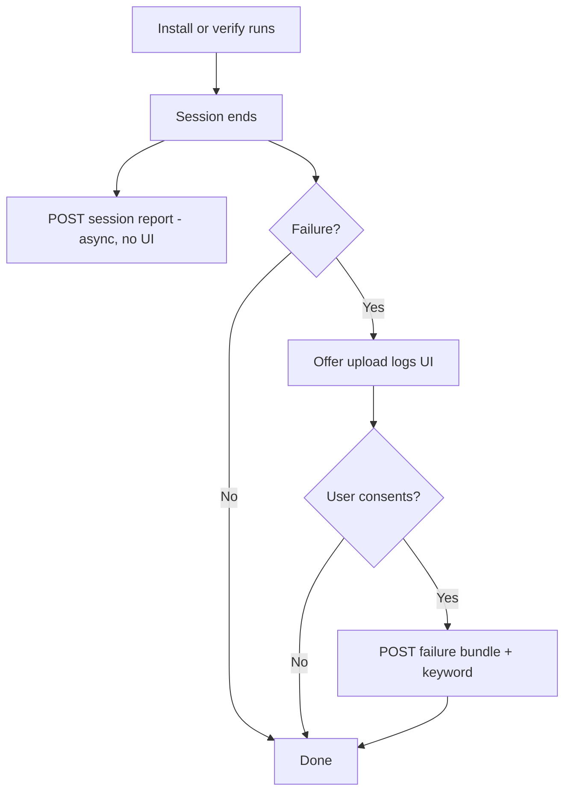
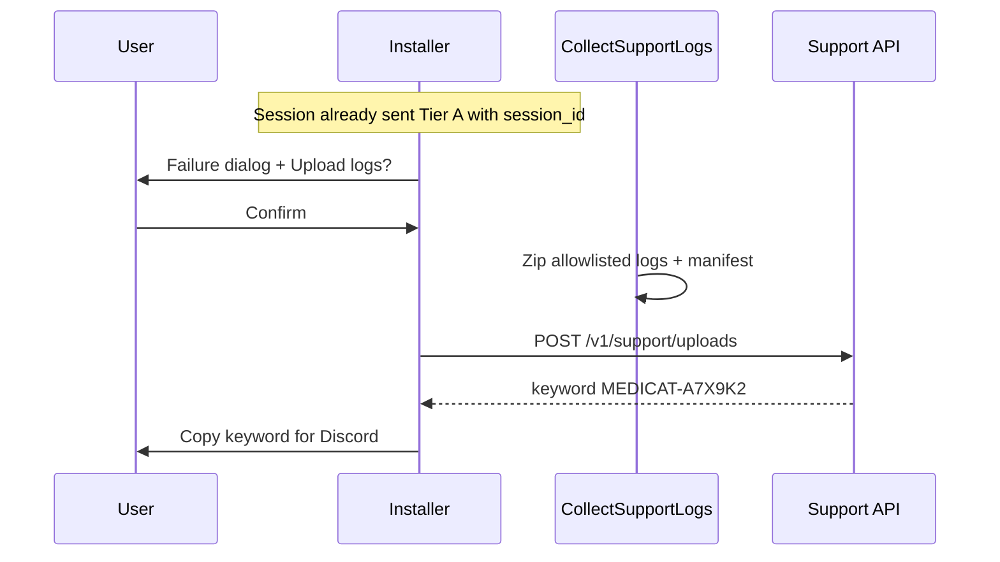

# Support telemetry & log upload — design

Two-tier reporting from the C++ installer:

1. **Session report (automatic)** — small JSON at end of every install/verify: success/failure, installer version, OS summary. **No prompt.** No log files.
2. **Failure bundle (on error only)** — zip of `.log` / `.txt` beside the exe when something fails; user consent before files leave the machine; returns a **support keyword** for Discord.

**Status:** Tier A session reports implemented in C++. Tier B (failure log upload) not yet implemented.  
**Related:** [`TODO.md`](../TODO.md) · [`SUPPORT_SERVER.md`](SUPPORT_SERVER.md) · [`debug.cpp`](../src/debug.cpp)

---

## Goals

1. Aggregate install/verify **success vs failure rates** and environment mix (OS build, arch) without bothering users.
2. On **failure only**, make it easy to send full diagnostics for debugging (logs + keyword).
3. Keep tiers separate: anonymous-ish session pings vs PII-heavy log bundles.
4. Reuse `DiagnosticContext` / `debug.cpp` for field population.

---

## Non-goals

- Uploading log files on **successful** sessions.
- Uploading MediCat `.7z`, USB contents, or executables.
- Real-time log streaming during install.
- User accounts or installer login.

---

## Two-tier model

| Tier | When | Prompt? | Payload | Purpose |
|------|------|---------|---------|---------|
| **A — Session report** | Every install/verify exit (success or fail) | **No** | ~1 KB JSON | Stats, trends, failure rate by OS/build |
| **B — Failure bundle** | Only when operation fails | **Yes** (log files contain PII) | Zip of allowlisted logs + manifest | Deep debug, Discord keyword |



Tier A runs even if the user declines Tier B. Tier B is never offered on success.

---

## Privacy & consent

### Tier A — Session report (default on)

Sent automatically at session end via background thread (same pattern as other network work — must not block `PostDone` or process exit for more than a few ms enqueue).

**Included (no PII by design):**

| Field | Example |
|-------|---------|
| `outcome` | `success`, `install_failed`, `verify_failed`, `cancelled`, `error` |
| `operation` | `install`, `verify` |
| `exit_code` | CLI/GUI mapped code (0–6) |
| `installer_version`, `installer_build`, `installer_arch` | `1.0.6`, `6`, `x64` |
| `medicat_usb_version`, `release_tag` | `21.12`, `3521-BETA` |
| `windows_build`, `windows_edition` | `26100`, `IoT Enterprise LTSC` |
| `processor_arch`, `logical_processors` | `x64`, `16` |
| `locale` | `en-US` |
| `format_requested`, `ventoy_requested` | booleans (options only, no drive letter) |
| `session_id` | Random UUID per run (links Tier B if uploaded later) |
| `duration_ms` | Wall time for the operation |

**Excluded from Tier A:** username, computer name, drive letters, paths, IP (client-side), failure message text, file names from USB.

**Opt-out:** Settings → **Send anonymous usage reports** (default **on**). When off, skip Tier A entirely. First-run or About screen: one-line disclosure + link to docs. No modal on every launch.

Store in `%AppData%\MedicatInstaller\preferences.json`:

```json
{
  "session_reports_enabled": true,
  "failure_log_upload_consent": "ask_on_failure"
}
```

### Tier B — Failure bundle (failure only)

| State | Behavior |
|-------|----------|
| **On failure** | Show **Upload logs for support** on error / re-extract-still-failed dialogs. |
| **Consent** | Dialog lists log file names; warns about username/paths inside logs. User confirms or skips. |
| **Opt-out (remembered)** | “Don’t offer log upload again” → hide Tier B buttons; Tier A still follows `session_reports_enabled`. |
| **Opt-in shortcut** | “Upload automatically when install fails” → Tier B runs without dialog on failure only (aggressive; Advanced setting). |

**CLI:** On non-zero exit, print local log paths. Optional `/upload-logs` requires explicit flag + network; never auto-upload files without flag or `failure_log_upload_consent: auto_on_failure`.

---

## Tier A — Session report API

### Endpoint

```
POST https://support.example.com/v1/sessions
Content-Type: application/json
```

Fire-and-forget from worker thread after `PostDone`. Ignore response body on success; log debug line on failure. Timeout 5 s max.

### Request body

```json
{
  "schema_version": 1,
  "session_id": "7c9e6679-7425-40de-944b-e07fc1f90ae7",
  "client": "MedicatInstaller",
  "installer_version": "1.0.6",
  "installer_build": 6,
  "installer_arch": "x64",
  "medicat_usb_version": "21.12",
  "release_tag": "3521-BETA",
  "operation": "install",
  "outcome": "verify_failed_after_reextract",
  "exit_code": 6,
  "duration_ms": 1840320,
  "locale": "en-US",
  "elevated": true,
  "options": {
    "format": true,
    "ventoy": true,
    "ventoy_gpt": false,
    "ventoy_secure_boot": true,
    "headless": false
  },
  "system": {
    "windows_build": 26100,
    "windows_major_minor": "10.0",
    "edition_id": "IoTEnterpriseS",
    "installation_type": "Client",
    "processor_arch": "x64",
    "logical_processors": 16,
    "ram_gb_bucket": "32"
  }
}
```

`ram_gb_bucket`: rounded bucket (`8`, `16`, `32`, `64+`) — not exact bytes.

### Response

```
204 No Content
```

Or `200` with empty body. No keyword. Idempotent on `session_id` (server dedupes retries).

### Server use

- Dashboards: success rate by `installer_build`, `windows_build`, `outcome`.
- Alert on spike in `ventoy_install_failed` for a new build.
- Join to Tier B via `session_id` when user uploads logs.

**What the server stores:** [`SUPPORT_SERVER.md`](SUPPORT_SERVER.md)

---

## Tier B — Failure log bundle

### When to offer / run

Trigger Tier B UI only from failure paths:

| Trigger | Offer upload? |
|---------|----------------|
| `PostDone(false, …)` after install | Yes |
| Verify failed (with or without re-extract) | Yes |
| Re-extract still failed | Yes (primary) |
| User cancelled | No |
| Success | **No** |
| `/help`, `/version` | No |

Optional Advanced: manual **Send logs** (any time) for power users — still requires consent.

### Log files (beside exe)

| File | When present |
|------|----------------|
| `medicat_installer.log` | Every session |
| `extract.log` | After extract |
| `reextract.log` | After selective re-extract |
| `check.log` | After verify |
| `failed_files.txt` | Verify failures |

**Deny:** `*.exe`, `*.7z`, archives, binaries, `Ventoy2Disk\`, USB paths.

Generated at upload time: `support_manifest.json` (full context for staff — may include drive letter and paths; **only inside Tier B zip**, not in Tier A).

### Client flow (failure only)



### Endpoint

```
POST https://support.example.com/v1/support/uploads
Content-Type: multipart/form-data
```

| Part | Required | Description |
|------|----------|-------------|
| `bundle` | yes | `support_upload.zip` |
| `session_id` | yes | Links to Tier A row |
| `manifest` | no | JSON copy for indexing |

### Response (201)

```json
{
  "upload_id": "550e8400-e29b-41d4-a716-446655440000",
  "keyword": "MEDICAT-A7X9K2",
  "expires_at": "2026-07-18T04:12:00Z"
}
```

---

## Client modules (planned)

| Module | Responsibility |
|--------|----------------|
| `support.cpp` | `SendSessionReport()`, `CollectSupportLogs()`, `UploadFailureBundle()`, preferences |
| `debug.cpp` | `BuildSessionReportJson()`, `BuildSupportManifest()` — shared field sources |
| `download.cpp` | WinHTTP POST JSON + multipart |
| `app.cpp` | Hook `PostDone` → Tier A always (if enabled); Tier B offer on `success == false` |

### Session report timing

```cpp
// Pseudocode — end of PostDone or RunParsed return
if (SessionReportsEnabled()) {
    std::thread([] { SendSessionReport(BuildSessionPayload()); }).detach();
}
```

Include `session_id` generated at app start (UUID v4), stored on `App` for Tier B linkage.

---

## Server & storage

### Sessions table (Tier A)

| Column | Notes |
|--------|-------|
| `session_id` | PK, UUID |
| `created_at` | UTC |
| `outcome`, `exit_code`, `operation` | Indexed |
| `installer_build`, `windows_build` | Indexed |
| `payload_json` | Full Tier A body |

Retention: **90 days** (aggregates kept longer; raw rows rolled up).

### Uploads table (Tier B)

| Column | Notes |
|--------|-------|
| `upload_id`, `keyword` | Staff lookup |
| `session_id` | FK → sessions |
| `object_key` | S3/R2 path to zip |
| `expires_at` | e.g. 30 days |

Staff: lookup by keyword or `session_id`; Discord bot `/medicat-logs MEDICAT-A7X9K2`.

---

## Security & rate limits

| Limit | Tier A | Tier B |
|-------|--------|--------|
| Per IP / hour | 60 sessions | 10 uploads |
| Max body | 4 KB JSON | 10 MB zip |
| Auth | Public ingest key | Same key |
| HTTPS | Required | Required |

Tier A: no PII → lower privacy risk; still allow opt-out.  
Tier B: consent required (except optional `auto_on_failure` Advanced); logs may contain username and paths.

---

## Configuration

```json
{
  "sessions_url": "https://support.example.com/v1/sessions",
  "uploads_url": "https://support.example.com/v1/support/uploads",
  "session_reports_default": true,
  "failure_upload_enabled": true
}
```

`session_reports_default: false` for enterprise/offline builds.

---

## Implementation phases

### Phase 1 — Session reports

- [ ] `session_id` at app start
- [ ] `BuildSessionReportJson()` from `DiagnosticContext` (PII-free subset)
- [ ] `SendSessionReport()` async POST
- [ ] Preference `session_reports_enabled` + Settings checkbox
- [ ] Server `POST /v1/sessions` + storage

### Phase 2 — Failure collection (local)

- [ ] `CollectSupportLogs()` allowlist + zip
- [ ] `BuildSupportManifest()` with drive/options (Tier B only)
- [ ] Wire failure dialogs to offer upload (no auto files yet)

### Phase 3 — Failure upload + keyword

- [ ] `UploadFailureBundle()` multipart
- [ ] Consent dialog + keyword UI
- [ ] Server uploads + keyword generation + staff lookup

### Phase 4 — Polish

- [ ] i18n for consent / keyword / settings disclosure
- [ ] CLI `/upload-logs`
- [ ] Dashboards from Tier A data

---

## i18n keys (planned)

**Settings / disclosure**

| Key | Purpose |
|-----|---------|
| `support.session_reports_label` | Send anonymous usage reports (installer version, OS, success/failure) |
| `support.session_reports_hint` | No log files or personal files are sent |

**Failure upload (Tier B only)**

| Key | Purpose |
|-----|---------|
| `support.upload_button` | Upload logs for support |
| `support.consent_title` | Send diagnostic log files? |
| `support.consent_body` | File list + PII note |
| `support.success` | Share this keyword in Discord: {0} |
| `support.failed` | Upload failed: {0} |

---

## Open questions

1. Is Tier A acceptable with **opt-out only** (no opt-in), given no PII? Legal/privacy review for EU users.
2. **`auto_on_failure`** for Tier B — ship in v1 or wait?
3. Include coarse **failure_class** in Tier A (`ventoy`, `extract`, `verify`, `format`) without message text?
4. Hosting: **`telemetry.medicatusb.com`** — see [`SUPPORT_SERVER.md`](SUPPORT_SERVER.md) for uploaded data; server repo is private.

---

## References

- Diagnostics already logged locally: [`src/debug.cpp`](../src/debug.cpp)
- Task checklist: [`TODO.md`](../TODO.md)
- WinHTTP: [`src/download.cpp`](../src/download.cpp)
